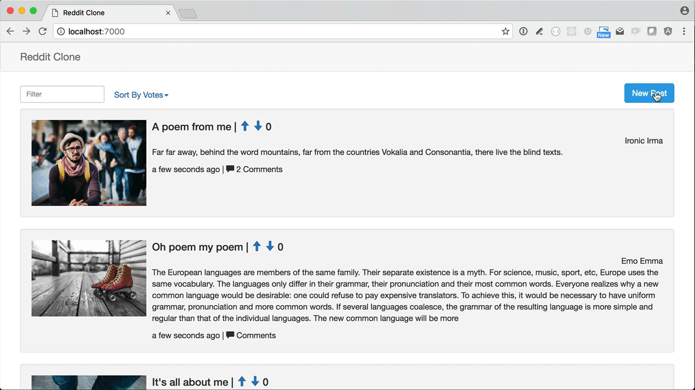
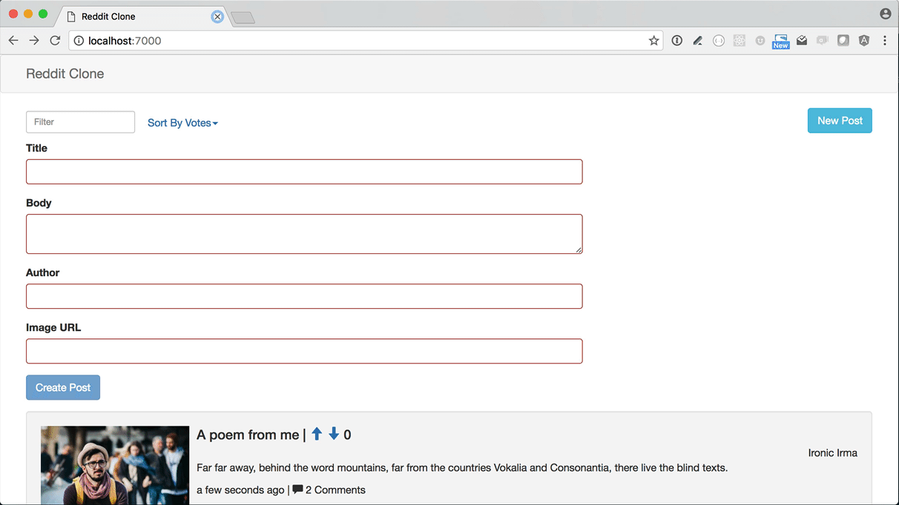
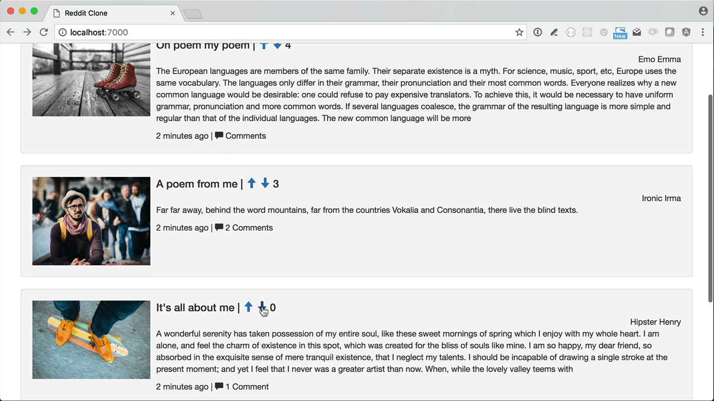

# Framework Exercise

For the first part, you will be implementing a message board application on the front end only.

This exercise will be considered successful when it:

- Fulfills all of the user stories
- Uses builtin components, directives, and filters
- Uses some kind of data binding (doesn't use direct DOM manipulation or save data to the DOM)
- Routes directly to "pages" in the Single Page App

- All post data will only be stored in memory
  - That is, a page refresh will clear all added posts, and that's fine
- You do _not_ have to make any ajax requests or actually contact an API

## User Stories

Feel free to style / theme / rename the app to make it something you might put on your portfolio.

**Users can create a post**

- Users can toggle the "New Post" form
- Users can create posts
  - Each post has a title, author, image, and description
- Users cannot create a new post if any of the inputs are blank
  - Fields should only appear invalid once they've tabbed off
- Users cannot click "Create Post" until the form is valid

**Users can view posts**

- Users see the number of comments correctly pluralized
  - i.e. "0 comments" or "1 comment"
- Users see posts dynamically reorder according to number of votes
- Users see the post's date/time displayed nicely
  - i.e. "Yesterday at 3:09pm", "4 minute ago", etc.

**Votes**

- Users can upvote
- Users can downvote
  - But not make it go lower than 0

**Filter**

- Users can filter based on the post title

**Sort**

- Users see posts ordered by votes (most first) by default
- Users can sort by Date or by Title

**Comments**

- Users can toggle comments
- Users can add comments

## Detailed Wireframes

**Posts**

Form toggle

Validations

Creating and viewing a post

**Votes**

Upvoting

Downvoting

**Filter**

**Sort**

**Comments**

-----

#  API Integration Assessment

For the second part, your application will actually hit an API.

In order to demonstrate that you've mastered the core concepts, you will be asked to build an app where:

- App has routes with dynamic path segments, configured with clean urls (html5Mode)
- Uses fetch/ajax and promises well
- App loads data from the server on page load (index page)
- Allows users to create records that appear on the screen without refreshing, and appear the same when refreshing (new records must get the id)
- Allows users to update records that update on the screen without refreshing, and appear the same when refreshing
- Allows users to remove records that disappear from the screen without refreshing, and don't reappear when refreshing
- Deep links should load data the same way as clicking from the index page
- Follows the appropriate styleguide for your framework

## Features

Take your existing message board and persist everything to the database, specifically:

- Loading posts and comments from the server
- Adding posts
- Voting (up or down)
- Adding comments

Also add the additional feature that users can edit a post.  

- When a user views the homepage
- Then every post should have an "edit" link
- And when they click the "edit" link
- They should be on `/posts/:id/edit`
- And they should see a post form identical to the one on the homepage
  - Except the button should say "Update Post"
  - All the same validation rules apply
- And when they click "Update Post"
- Then they should be redirected to the homepage

**Designs**

Edit link:

Edit form:

# reddit-clone
